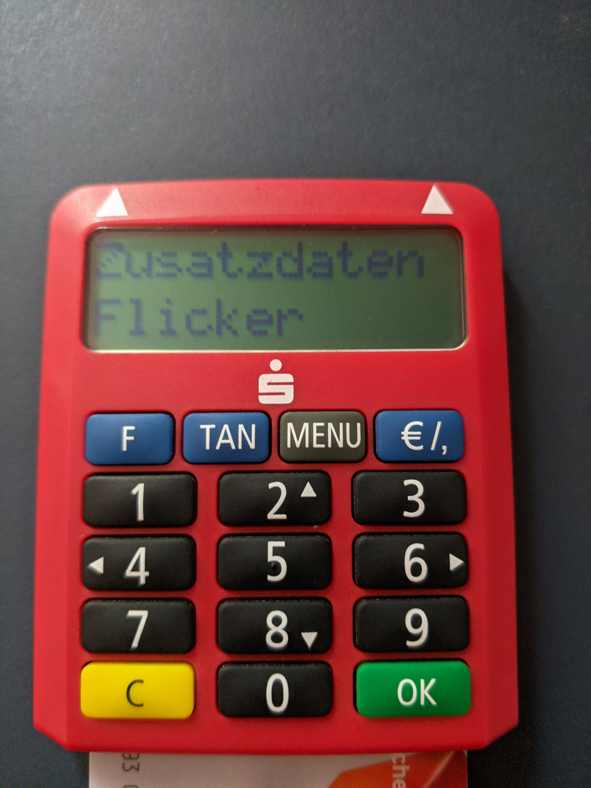

# Python-Flicker

Mit diesem Python modul lässt sich ein Flicker-Code erstellen bzw. auslesen.
Mit diesem Code wird oft der TAN-Code für eine Onlineüberweisung übertragen.


## Beispiel (Erzeugen)
```python
from flicker import create_flicker
    
# Initalisieren des Modules mit den nötigen Einstellungen
c = create_flicker.create(HIGH=100, BAR_SIZE=25, SPACE=10, SPACE_BEGIN_END=10, DURATION=50)
    
# Erzeugen eines Flicker-Codes
c.create("Python", "Flicker", filename="Flicker Test.gif")
```

## Erzeugtes GIF


## TAN-Generator



## Beispiel (Auslesen)
```python
from flicker import decode_flicker

# Initalisieren des Modules mit den nötigen Einstellungen
d = decode_flicker.decode(file="Flicker Test.gif", check_luhn=True,
check_xor=True)

# Daten auslesen
print(d.get_data())

# Alle Infos auslesen
print(d.get_info())

```

### Ausgabe get_data()
```python
['Python', 'Flicker']
```

### Ausgabe get_info()
```python
{
    'Länge': 21, 
    'Image': {
        'Frames': 96, 
        'Bars': [(10, 35), (45, 70), (80, 105), (115, 140), (150, 175),
        'Startframe': 0
    }, 
    'Startcode': {
        'Kodierung': 'BCD',
        'Länge': 4,
        'Daten 1': ['IBAN', 'Bankdaten'],
        'Daten 2': ['Bankdaten', 'Betrag'],
        'Zufallszahl': 3
    },'Daten 1': {
        'Kodierung': 'ASCII',
        'Länge': 6,
        'Daten': 'Python'
    },
    'Daten 2': {
        'Kodierung': 'ASCII',
        'Länge': 7,
        'Daten': 'Flicker'
    },
    'Prüfsummen': {
        'Luhn': 0,
        'XOR': 5
    }
}
```